# Overview

GitHub hosts over 25 million repositories containing applications of all
shapes and sizes. But GitHub is just a start---those applications still
need to get built, released, and managed to reach their full potential.

With the introduction of [Azure DevOps](https://azure.com/devops),
Microsoft offers developers a new continuous integration/continuous
delivery (CI/CD) service called [Azure
Pipelines](https://azure.microsoft.com/services/devops/pipelines/) that
enables you to continuously build, test, and deploy to any platform or
cloud. It has cloud-hosted agents for Linux, macOS, and Windows;
powerful workflows with native container support; and flexible
deployments to Kubernetes, VMs, and serverless environments.

Azure Pipelines provides unlimited CI/CD minutes and 10 parallel jobs to
every GitHub open source project for free. All open source projects run
on the same infrastructure that our paying customers use. That means
you'll have the same fast performance and high quality of service. Many
of the top open source projects are already using Azure Pipelines for
CI/CD, such as Atom, CPython, Pipenv, Tox, Visual Studio Code, and
TypeScript---and the list is growing every day.

In addition to Azure Pipelines, GitHub users can also benefit from
[Azure Boards](https://azure.microsoft.com/services/devops/boards/), a
set of features that enable you to plan, track, and discuss work across
your teams using Kanban boards, backlogs, team dashboards, and custom
reporting. You can link GitHub activities from Azure Boards by
mentioning them in commits and pull requests, and even automate the
state transition of linked work items when pull requests are approved.

In this demo, you'll see how easy it is to set up Azure Pipelines and
Azure Boards with your GitHub projects and how you can start seeing
benefits immediately.

# Key Takeaways

The key takeaways of the demo are:

-   Microsoft provides the only comprehensive DevOps solution that spans
    from development to project management to deployment to operations.

-   It doesn't matter what technologies of processes you're using---even
    setting up a Node.js solution on GitHub to deploy to a Linux
    container that connects to a Cosmos DB is a seamless,
    straightforward experience.

-   Azure offers a practical approach to automation at every step of the
    DevOps lifecycle that enables companies to focus their efforts on
    creating business value.


=============

## Prerequisites


These items are required for this demo.

1.  A GitHub account from <https://github.com>.

2.  An Azure account from <https://azure.com>.

3.  An Azure DevOps account from <https://dev.azure.com>

**Note:** If you are using your own machine, you will also need  the following:

4.  ARM Outputs extension installed in your Azure DevOps account from
    <https://marketplace.visualstudio.com/items?itemName=keesschollaart.arm-outputs>.

5.  Git installed from <https://git-scm.com/downloads>.

6.  Visual Studio Code installed from <https://code.visualstudio.com>.

7.  Azure Pipelines extension for Visual Studio Code installed from
    <https://marketplace.visualstudio.com/items?itemName=ms-azure-devops.azure-pipelines>.

8.  GitHub Pull Requests extension for Visual Studio Code installed from
    <https://marketplace.visualstudio.com/items?itemName=GitHub.vscode-pull-request-github>.

## Demo Setup
You will need to perform these steps prior to presenting this demo.

1.  Clone the GitHub repo locally and open it in Visual Studio Code.

1.  Create a new Azure DevOps project, preferably named something like
    "ContosoAir".

1.  Have two separate browser tabs open and logged in: one on the GitHub
    project root and one on the Azure portal.

============

## Demo Scenario

In this demo, we'll be illustrating the integration and automation
benefits of Azure DevOps. We will take on the role of helping a
fictitious airline---Contoso Air---that has developed their flagship web
site using Node.js. To improve their operations, they want to implement
pipelines for continuous integration and continuous delivery so that
they can quickly update their public services and take advantage of the
full benefits of DevOps and the cloud.

The site will be hosted in Azure, and they want to automate the entire
process so that they can spin up all the infrastructure needed to deploy
and host the application without any manual intervention. Once this
process is in place, it will free up their technology teams to focus
more on generating business value.

## Exercise 1: Setting up automated CI/CD pipelines with Azure Pipelines

In this demo, we will help Contoso Air revamp a critical component of their DevOps scenario. Like all airlines, they rely on their web site to generate and manage business opportunities. However, the current processes they have in place to move a change from their source code to their production systems is time-consuming and open to human error. They use GitHub to manage their source code and want to host their production site on Azure, so it will be our job to automate everything in the middle. 

This will involve setting up a pipeline so that commits to the GitHub
repo invoke a continuous integration build in Azure DevOps. Once that build is complete, it will invoke a continuous delivery deployment to push the bits out to Azure, creating the required resources, if necessary. The first thing we need to do is to connect GitHub with Azure DevOps, which we can do via the Azure Pipelines
extension in the GitHub Marketplace.

============

### Task 1 -- Installing Azure Pipelines


1. Fork the GitHub project at
    [https://github.com/Microsoft/ContosoAir/](https://github.com/Microsoft/ContosoAir/). 

1. Switch to the browser tab open to the root of your GitHub fork. It
    should be something like **<https://github.com/{youraccount}/ContosoAir>**

    
1.  Navigate to the [**GitHub Marketplace**](https://github.com/marketplace).

    
   

1.  Search for **"pipelines"** and click **Azure Pipelines**.  

    
   
   

1.  Scroll to the bottom and click **Install it for free**. If you previously installed Azure Pipelines, select **Configure access** instead to skip steps 6-8. 

    

    >**Note:** Azure Pipelines is free to use for both public and private repos. You get unlimited build minutes and 10 free parallel jobs for public repositories. For private repos, you get 1 free parallel job and 1800 minutes per month. If you have a need to scale your builds, you can add parallel job support for a nominal fee. I

1.  If you have multiple **GitHub** accounts, select the one you forked
    the project to from the **Switch billing account** dropdown.

    

1.  Click **Complete order and begin installation**.

    


    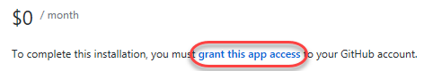

1.  Select the repositories you want to include (or **All
    repositories**) and click **Install**.
    
    > **Note** that if you've previously installed Azure Pipelines, you may
    need to toggle between the "All" and "Select" radio buttons to enable the 
    wizard in Task 2. You can always create the pipeline directly from Azure
    Pipelines if the wizard does not appear.

    

===============

### Task 2 -- Configuring an Azure Continuous Integration Pipeline

Now that Azure Pipelines has been installed in the GitHub account, we can configure Azure DevOps to use it. You may select an existing or create a new Azure DevOps project  to hold and run the pipelines we need for continuous integration and continuous delivery. The first thing we'll do is to create the build pipeline.

1.  Select the organization and Azure DevOps project that you want to use. If you do not have one, you can create for free.

    

2.  Select the forked repo.

    
   

    >Every build pipeline is simply a set of tasks. Whether it's copying files, compiling source, or publishing artifacts, the existing library of tasks covers the vast majority of scenarios. You can even create your own if you have specialized needs not already covered. We're going to use YAML, a markup syntax that lends itself well to describing the build pipeline. Note that the Node.js pipeline as a starting point based on an analysis of our source project. We'll replace the contents with the final YAML required for our project.

3.  Select the recommended template.

    

4.  Replace the default template with the YAML below.

    ````yaml

    pool:  
      vmImage: 'ubuntu-16.04' 

    steps:
      - task: CopyFiles@2
        displayName: 'Copy Files to: $(build.artifactstagingdirectory)/Templates'
        inputs:
          SourceFolder: deployment
          Contents: '*.json'
          TargetFolder: '$(build.artifactstagingdirectory)/Templates'

      - task: Npm@1
        displayName: 'npm custom'
        inputs:
          command: custom
          verbose: false
          customCommand: 'install --production'

      - task: ArchiveFiles@2
        displayName: 'Archive $(Build.SourcesDirectory)'
        inputs:
          rootFolderOrFile: '$(Build.SourcesDirectory)'
          includeRootFolder: false

      - task: PublishBuildArtifacts@1
        displayName: 'Publish Artifact: drop'
        
    ````

5.  Click **Save and run**.

    

6.  Confirm the **Save and run** to commit the YAML definition directly
    to the master branch of the repo.

    

7.  Follow the build through to completion.

====================

### Task 3 -- Configuring an Azure Continuous Delivery Pipeline

 Now that the build pipeline has been created and the first build has completed, we can turn our attention to creating a release pipeline. Like the build templates, there are many packaged options available that cover common deployment scenarios, such as publishing to Azure. But to illustrate how flexible and productive the experience is, we will build this pipeline from an empty template.

1.  Click **Release**.

    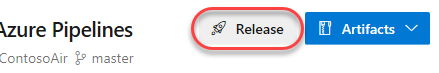

2.  Click **Empty job**.

    

    \> The first item to define in a release pipeline is exactly what will be released and when. In our case, it's the output
    generated from the build pipeline. Note that we could also assign a
    schedule, such as if we wanted to release the latest build every
    night.

3.  Select the associated artifact. If the build artifact is not already associated, click **Add an artifact** instead.

    

4.  Set **Source** to the build pipeline created earlier and **Default
    version** to **Latest**. Change the **Source alias**, if you want, to something like **"\_ContosoAir-CI"** and click **Add**. Note that this is an identifier (typically a short name) that uniquely identifies an artifact linked to the release pipeline. It cannot contain the characters: \ / : * ? < > | or double quotes

    

    \> As we did with continuous integration starting on a source commit, we also want to have this pipeline automatically start when the build pipeline completes. It's just as easy.

5.  Click the **Triggers** button on the artifact.

    

6.  **Enable** continuous integration, if it is not already enabled.

    

    \>  We also have the option of adding quality gates to the release process. For example, we could require that a specific user or group approve a release before it continues, or that they approve it after it's been deployed. These gates provide notifications to the necessary groups, as well as polling support if you're automating the gates using something dynamic, such as an Azure function, REST API, work item query, and more. We won't add any of that here, but we could easily come back and do it later on.

7.  Click the **pre-deployment conditions** button.

    

8.  Review pre-deployment condition options.

    

    \>  In this pipeline, we're going to need to specify the same resource group in multiple tasks, so it's a good practice
    to use a pipeline variable. We'll add one here for the new Azure resource group we want to provision our resources to. Note that
    there are also a variety of deployment options we can configure, as well as a retention policy.

9.  Select the **Variables** tab.

    

10. **Add** a **resourcegroup** variable that is not currently used by
    an existing resource group in your Azure account (**"contosoair"**
    will be used in this script).

    

    \>  Also, just like the build pipeline, the release pipeline is really just a set of tasks. There are many
    out-of-the-box tasks available, and you can build your own if needed. The first task our release requires is to set up the Azure
    deployment environment if it doesn't yet exist. After we add the task, I can authorize access to the Azure account I want to deploy
    to and instruct it to use the variable name we just specified for the resource group name.

11. Select the **Tasks** tab.

    

12. Click the **Add task** button.

    

13. Search for **"resource"** and **Add** an **Azure Resource Group
    Deployment** task.

    

14. Select the newly created task.

    

15. Select and authorize an Azure subscription.

    

16. Set the **Resource group** to **"\$(resourcegroup)"** and select a
    **Location**.

    

    \>  Rather than having to manually create the Azure
    resources required to host the web app, the team has defined an
    Azure Resource Manager---or ARM---template that describes the
    environment in JSON. This allows the environment definition to be
    updated and managed like any other source file. These were the files
    we copied to the Templates folder during the build pipeline. You can
    also override the template parameters as part of this configuration,
    which we'll do here using my name.

17. Enter the settings below. You can use the browse navigation to
    select them from the most recent build output.

    Template:
    **\$(System.DefaultWorkingDirectory)/\_ContosoAir-CI/drop/Templates/azuredeploy.json**
    Template parameters:
    **\$(System.DefaultWorkingDirectory)/\_ContosoAir-CI/drop/Templates/azuredeploy.parameters.json**

    You will also need to set **Override template parameters** to
    generate an Azure app service name that is globally unique, so your
    name is recommended. For example, if your name is **John Doe**, use
    something like **"-p\_environment johndoe"**. This will be used as
    part of the app service name in Azure, so please limit it to
    supported characters.

    

    \>  When this task completes, it will have generated
    an Azure resource group with the resources required to run our
    application. However, the ARM template does some processing of the
    variables to generate names for the resources based on the input
    variables, which we will want to use in future tasks. While we could
    potentially hardcode those variables, it could introduce problems if
    changes are made in the future, so we'll use the ARM Outputs task to
    retrieve those values and put them into pipeline variables for us to
    use. This task happens to be a 3^rd^ party task I installed earlier
    from the Visual Studio Marketplace. It contains this and many other
    extensions for Azure DevOps from both Microsoft and 3^rd^ parties.

18. Click the **Add task** button.

    

19. Search for **"arm"** and select **Learn more \| More information**.
    This will open the GitHub project for this extension in a new tab.

    

20. Click the link to the Visual Studio Marketplace.

    

21. Close the new tab.

    

    \> Now let's get back to adding the ARM Outputs
    task. The key variable we care about here is the name of the app
    service created, which our ARM template has specified as an output.
    This task will populate it for us to use as the "web" variable in
    the next task.

22. **Add** an **ARM Outputs** task.

    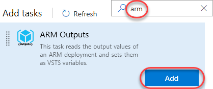

23. Select the newly created task.

    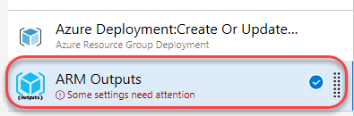

24. Select the same subscription from the previous task and enter the
    same resource group variable name.

    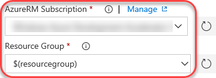

    \> Finally, we can deploy the app service. We'll use
    the same subscription as earlier and specify the web variable as the
    name of the app service we want to deploy to. By this time in the
    pipeline, it will have been filled in for us by the ARM Outputs
    task. Also note that we have the option to specify a slot to deploy
    to, but we'll talk about deployment slots later on.

25. Click the **Add task** button.

    

26. Search for **"app service"** and **Add** an **Azure App Service
    Deploy** task.

    

27. Select the newly created task.

    

28. Select the same subscription as earlier.

    

29. Enter the **App Service name** of **"\$(web)"**.

    

30. **Save** the pipeline.

    

### Task 4 -- Invoking Continuous Delivery from GitHub to Azure

\>  Now that we have our pipelines in place, it's time to
commit a change to the master branch on GitHub. We're going to pull down
the azure-pipelines.yml file added by Azure DevOps during the build
creation and commit a slight edit to trigger the CI/CD process.

1.  Open the ContosoAir project in Visual Studio Code.

2.  From the **Source Control** tab, select **Sync** from the **More
    Actions** dropdown.

    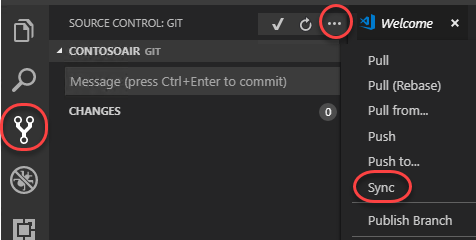

3.  From the **Explorer** tab, open **azure-pipelines.yml**.

    

    \>  Before we make our change, let's take a quick
    look at the build tasks. There are four steps required for the
    build. First, deployment templates are copied to a target folder for
    use during the release process. Next, the project is built with NPM.
    After that, the built solution is archived and finally published for
    the release pipeline to access. With the Azure Pipelines extension
    for Visual Studio Code, you get a great YAML editing experience,
    including support for IntelliSense.

4.  Examine the tasks within the pipeline definition.

5.  Make a change to show IntelliSense offered by the extension.

6.  Undo any changes to avoid breaking the definition.

7.  Add a newline to the end of the file. The purpose is simply to
    produce a change to the file you can commit, but without impacting
    the working build.

8.  Press **Ctrl+S** to save the file.

    \>  Now we can commit and push the updated build
    definition to GitHub. This will invoke a continuous integration
    build in Azure DevOps, which will trigger a continuous delivery to
    Azure upon completion.

9.  From the **Source Control** tab, enter a commit message like
    **"Updated build pipeline"** and press **Ctrl+Enter** to commit.
    Confirm if prompted.

    

10. Press the **Synchronize Changes** button at the bottom of the window
    to push the commit to the server. Confirm if prompted.

    

    \> Back in Azure DevOps, we can see that our build
    pipeline has kicked off a new build. We can follow as it executes
    the tasks we defined earlier, and even get a real-time view into
    what's going on at each step. When the build completes, we can
    review the logs and any tests that were performed as part of the
    process.

11. Return to Azure DevOps and navigate to the **Builds** hub.

    

12. Click the new build.

    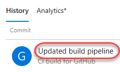

13. Track the build tasks.

    

14. Follow the build through to completion.

    

    \> Now that the build has completed, let's check out
    the release. It was automatically invoked by the successful
    completion of the build pipeline, and we can follow it all the same.
    Since this is the first time we're deploying, Azure will need to
    provision the resources. That can take a minute, so let's check back
    in later.

15. Navigate to the **Releases** hub.

    

16. Select the new release. If one is not immediately available, click
    the **Refresh** option.

    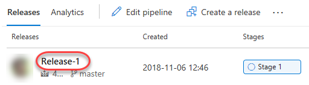

17. Click **In progress** to follow the release process.

    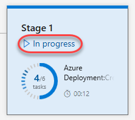

18. Note that it will take a few minutes (around 5 at the time of
    drafting) for the app to finish deploying due to heavy first-time
    operations. Move ahead to the next step while it works in the
    backgroud.

    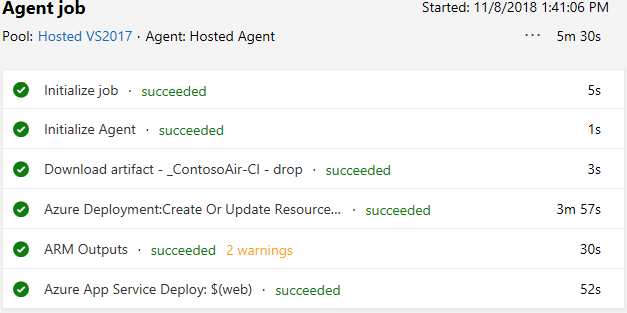
    
=========================
Task 5 -- Reviewing the Application and Azure Portal
----------------------------------------------------

\> While the resources finish spinning up, let's take a
quick tour of the Azure portal. It's thoughtfully designed and easy to
use. The navigation on the left hand side provides access to major
platform components, such as app services and virtual machines.
Solutions are organized as resource groups, which are logical
collections of the resources used to run your solution. We'll search for
the solution our release pipeline created earlier.

1.  Switch to the Aure portal tab (<https://portal.azure.com>).

2.  Review the left-hand navigation.

3.  Search for your resource group name and open it.

    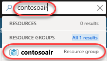

    \> Our solution requires three resources in Azure.
    The app service is our web site and the app service plan is the
    virtual server farm the site is deployed to. The Cosmos DB is a
    globally-distributed, multi-model database service instance we're
    using to manage all of the data in the site. Let's take a closer
    look at the app service.

4.  Click the **App Service**. If this isn't available yet, check in on
    the release pipeline to make sure the Azure Deployment task didn't
    fail. Otherwise, refresh occassionaly until it is. Keep in mind that
    the app service will be available before the app itself is deployed,
    so the actual site itself won't be ready until the pipeline
    completes.

    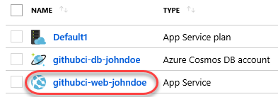

    \> This view is the dashboard for the app service
    and provides convenient access to virtually everything we could ever
    need to do. One of the most useful features for DevOps professionals
    is the "diagnose and solve problems" view that offers quick access
    to a variety of self-diagnostic features. These features include
    checks for typical issues related to availability, performance, and
    configuration.

5.  Click **Diagnose and solve problems**.

    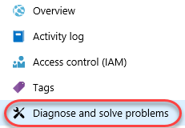

6.  Review the options.

    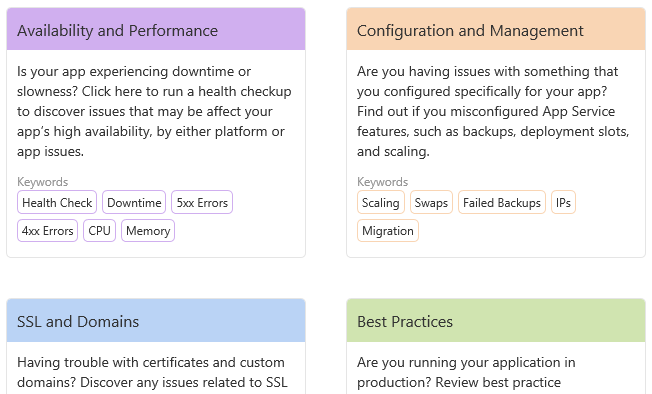

    \> The deployment center provides a single place to
    track deployment, such as those that are automated via pipeline. You
    can also use and track deployment slots, which allow you to have
    additional release targets. For example, you might make it a policy
    to always deploy to the staging slot so that your team has an
    opportunity to review and run tests before making it public.
    Configuring a release pipeline to push to a specific slot is a
    setting available in deployment tasks.

7.  Click **Deployment Center**.

    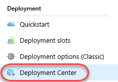

8.  Review the deployment.

    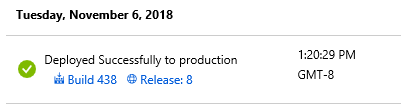

    \> The "application settings" view enables you to
    define system-level settings for the environment, such as versions
    of .NET or PHP. You can also configure virtual applications and
    directories, as well as application-level settings, such as
    connection strings.

9.  Click **Application settings**.

    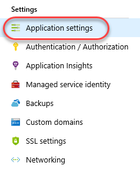

    \> Application Insights is one of the most valuable
    services for DevOps teams. It provides performance tracking and
    management features for every level of an application. We haven't
    configured it for this project yet, but once it's in place, you can
    trace an action in a web browser all the way through the web request
    into an API and down to the resources it's dependent on. If there's
    an error somewhere along the way, it's really easy to diagnose the
    cause so that teams spend more time working on improvements than
    troubleshooting.

10. Click **Application Insights**.

    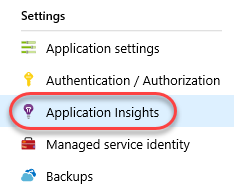

    \> One of the great benefits of a cloud platform is
    how easily you can scale a platform up and out. For example, we have
    the option here to scale our current application up to use a pretty
    powerful set of virtual hardware. Or, depending on our needs, we can
    use the scale out option to add more instances as well. There is
    even an autoscale option to automatically add and remove instances
    based on load.

11. Click **Scale up**.

    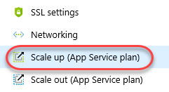

12. Review options.

    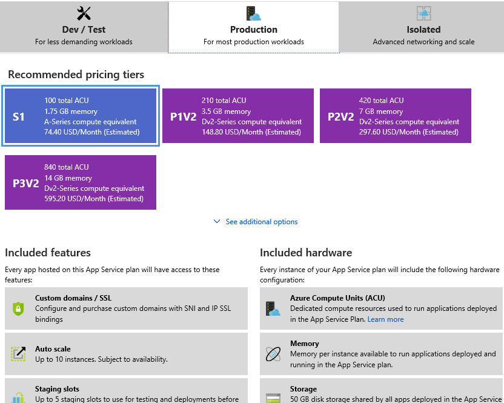

    \> In addition to web sites, you can also build and
    deploy web jobs. These are standalone apps or scripts that can be
    invoked via web hook. You can also use them in combination with a
    scheduler to perform regular tasks, such as batch updates to your
    data store.

13. Click **WebJobs**.

    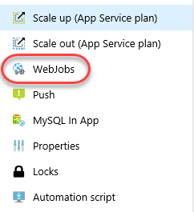
    \> There's also a console option for you to explore
    what's going on in your service. For example, let's get a directory
    listing of the web root.

14. Click **Console**.

    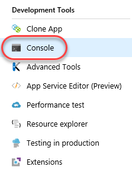

15. Execute a **"dir"** command.

    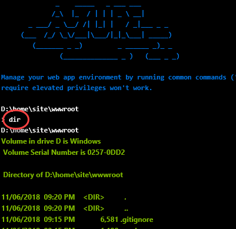

    \> There are also plenty of built in monitoring and
    alerting features. These save you a lot of time so you can focus on
    developing business value instead. And if you're looking for advice
    on places to improve the application, there's the App Service
    Advisor. Things are looking good now, but we'll want to keep an eye
    on this for future suggestions.

16. Review monitoring options.

    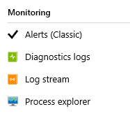

17. Click **App Service Advisor**.

    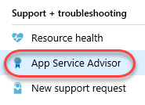

18. Review insights.

    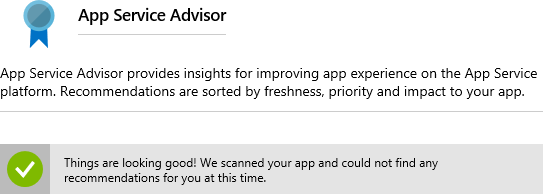

    \> That was a quick tour of the app service
    configuration, so let's check out the actual site in the cloud. We
    just took a project in GitHub and set up a sophisticated, automated
    deployment to Azure in mere minutes!

19. Click the **URL** to open the site.

    

20. Review the site. Keep the browser window open for later.

    

============

Task 7 -- Managing GitHub Projects with Azure DevOps
----------------------------------------------------

\> Azure Boards provides a wealth of project management functionality that spans Kanban boards, backlogs, team dashboards, and
custom reporting. By connecting Azure Boards with GitHub repositories, teams can take advantage of the rich project management capabilities. You can create links between GitHub commits and pull requests to work items tracked in Azure Boards. This enables a seamless way for you to use GitHub for software development while using Azure Boards to plan and track your work.

1.  Return to the Azure DevOps tab.

2.  Navigate to **Boards \| Backlogs**.

    

    \> In our scenario, users will need to be able to book flights by selecting the cities involved. We will create a new
    user story to sort the airports listed in the booking form in alphabetical order by city. Ordinarily we would create the user
    story at a higher level and add tasks to define how the story is to be implemented, but for our demo purposes here we'll leave it as a
    single work item.

3.  Click **New Work Item** and add a user story with the title **"User
    can select airport by city"**. Press **Enter** to create.

    

    \> In addition to working with work items in a backlog, we have a very flexible Kanban board option. With the
    board, we can edit items on a card in line, or even drag cards  around to change their state and assignment. Let's take ownership of
    the new user story so we can begin work.

4.  Click **View as board**.

    

5.  Drag the newly created user story to the **Active** column.

    

6.  Dropping the user story onto the **Active** column assigns it to you
    and sets its **State** to **Active**. Make note of the task ID for
    reference later during a future commit and pull request.

    

\> In order to complete our integration, we'll need to wire up a connection between this project and the GitHub repo.

7.  Click **Project settings**.

    

8.  Under **Boards**, select **GitHub connections**.

    

9.  Click **Connect your GitHub account**.

    

10. Select the project repo and click **Save**.

    

    \> Let's take a look at our deployed site to see
    what the current booking experience is like. As you can see, the
    airports appear to be sorted by airport code, which isn't the
    behavior we want our users to see.

11. Return to the web app tab and click **Login**.

    
   
   

12. Log in with any email and password.

    
   

13. Click **Book**.

    
   

14. Expand the airport dropdown to note that it's not sorted
    alphabetically by city.

    
   
==============

Task 8 -- Committing to Complete a Task
---------------------------------------

1.  Return to **Visual Studio Code**.

    \> We'll start off by creating a new branch for this
    task. The work itself is pretty straightforward. We just need to
    locate the place where airports are provided to the user experience
    and make sure they're being sorted by city name.

2.  Click the **master** branch at the bottom of the window.

    
   

3.  From the top of the screen, click **Create new branch**.

    
   

4.  Enter the name **"airport-sorting"** and press **Enter**. This will
    activate the new branch.

    
   

5.  From the **Explorer** tab, open
    **src/services/book.form.service.js**.

    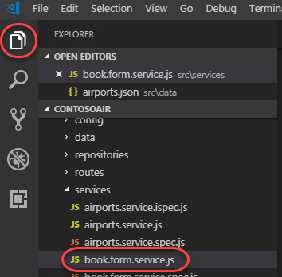
   

6.  Locate the **getForm** function and replace the existing
    **airports** initializer with the code below. This will sort the
    airports by city.

    ````
    airports: this.\_airports.getAll().sort(function(first, second) {

    return first.city.localeCompare(second.city);})

    ````

    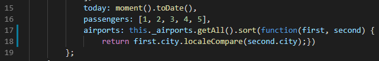
   

7.  Press **Ctrl+S** to save the file.

    \> We'll skip testing this locally for the sake of
    the demo. Instead, we'll commit it using a comment that includes
    special syntax to link it to the Azure Boards task we saw earlier.
    Now this commit will become trackable from project management, as
    long as we include the phrase "Fixes AB\#ID".

8.  Switch to the **Source Control** tab and enter a commit message of
    **"Changes airport sorting. Fixes AB\#3464."**, but replace **3464**
    with the actual ID of the Azure Boards task. Press **Ctrl+Enter**
    and confirm the commit if prompted.

    
   

9.  Click the **Publish Changes** button at the bottom of the screen.

    
   

10. When the push has completed, return to the GitHub browser tab.

    \> With the commit pushed, we'll create a pull
    request to drive those changes back into the master branch. In this
    case we're inheriting the title from the commit, but having the pull
    request mention "Fixes AB\#ID" will link and complete the target
    work item when the pull request is merged.

11. Click **Compare & pull request**, which should appear on its own. If
    not, refresh.

    
   

12. Change the **base fork** to point at your project. By default it
    points at the original Microsoft repo, so be sure to change it.

    
   

13. The title should initialize to the commit message entered earlier.
    Click **Create pull request**.

    
   

14. Return to Visual Studio Code.

    \> Now we'll switch to the other side of the pull
    request and take on the role of reviewer. We can use Visual Studio
    Code to check out the pull request, analyze changes, and comment.
    Assuming we trust the fix, we can merge the pull request to update
    master and kick off the CI/CD.

15. Under **GitHub Pull Requests \| All**, right-click the pull request
    and select **Checkout Pull Request**.

    
   

16. Expand the **Changes in Pull Request** tree.

    
   

17. Select the **Description** from under the original pull request.

    
   

18. Review the details of the pull request.

    
   

19. Click **Merge pull request** and confirm the merge.

    
   

    \> Once the deployment works its way through build
    and release, we can confirm the new functionality.

20. Follow the CI/CD pipeline through to completion.

21. Refresh the web app site. Return to the booking page (you'll need to
    log in again) and confirm the airports are sorted by city now
    (scroll down past the airports with no city name).

    
   

22. Return to the Azure DevOps tab open to the Kanban board.

    \> Since the user story we were working on was
    linked in a pull request that was approved, Azure DevOps will
    automatically transition the state of the work item to "Closed". You
    can also see that the related GitHub commits and pull request were
    linked to the work item.

23. The user story should have already moved to the **Closed** state and
    column. Click to open it.

    
   

24. The commit and pull request should now be visible under
    **Development**.

    
   

Summary
=======

Many organizations have their projects hosted in GitHub, and we just
showed how you can set up automated deployment to Azure in minutes. And
it doesn't matter what kind of application they're building or what kind
of environment they're deploying to. Once this automation is in place,
companies can turn their focus to developing business value instead of
infrastructure.
